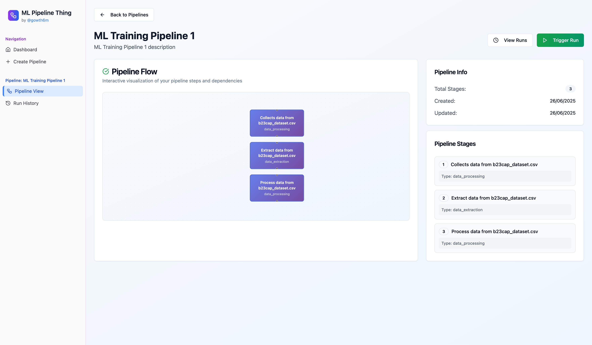

# ML Pipeline Thing

A lightweight machine learning pipeline orchestration system with a modern web interface.

## Overview

ML Pipeline Thing provides a streamlined way to manage and monitor machine learning workflows. It consists of a FastAPI backend for pipeline orchestration and a React frontend for visualisation and management.

## Demo

- https://ml-pipeline-thing.gowtham.io
- https://api.ml-pipeline-thing.gowtham.io/docs



## Features

- Pipeline creation and management
- Run monitoring and history
- React basic dashboard UI

## Project Structure

```
ml-pipeline-thing/
├── backend/          # FastAPI backend
├── frontend/         # React frontend
├── infra/           # Infrastructure configuration
└── docs/            # Documentation
```

## Getting Started

### Backend

```bash
cd backend
poetry install
poetry run uvicorn src.main:app --host 0.0.0.0 --port 9095 --reload
```

### Frontend

```bash
cd frontend
npm install
npm run dev
```
